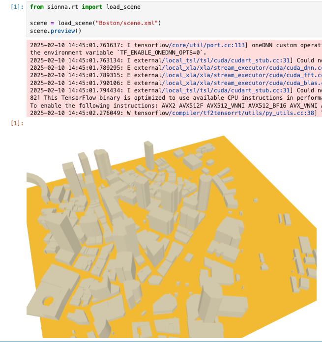

# Geo2SigMap: High-Fidelity RF Signal Mapping Using Geographic Databases

Welcome to the Geo2SigMap, this is the first work that: 
* Designs an automated framework that integrates open-source tools, including geographic databases (OSM), computer graphics (Blender), and ray tracing (Sionna), and supports scalable ray tracing and RF signal mapping at-scale using real-world building information;
* Develops a novel cascaded U-Net architecture that achieves significantly improved signal strength (SS) map prediction accuracy compared to existing baseline methods based on channel models and ML.

## Note: Current branch is under code refactoring. Only the 3D scene generation pipeline is available. ML part will be published later.
## TABLE OF CONTENTS
1. [Overview](#overview)
2. [Installation](#installation)
3. [Example Usage](#example-usage)
4. [License](#license)

## Overview

Geo2SigMap is an efficient framework for high-fidelity RF signal mapping leveraging geographic databases, ray tracing, and a novel cascaded U-Net model. Geo2SigMap features an automated pipeline that efficiently generates 3D building and path gain (PG) maps via the integration of a suite of open-sourced tools, including OpenStreetMap (OSM), Blender, and Sionna. Geo2SigMap also features a cascaded U-Net model, which is pre-trained on pure synthetic datasets leveraging the building map and sparse SS map as input to predict the full SS map for the target (unseen) area. The performance of Geo2SigMap has been evalauted using large-scale field measurements collected using three types of user equipment (UE) across six LTE cells operating in the citizens broadband radio service (CBRS) band deployed on the Duke University West Campus. Our results show that Geo2SigMap achieves significantly improved root-mean-square error (RMSE) in terms of of the SS map prediction accuracy compared to existing baseline methods based on channel models and ML.

If you find Geo2SigMap useful for your research, please consider citing:
```
@article{li2023geo2sigmap,
  title = {{Geo2SigMap}: High-Fidelity {RF} Signal Mapping Using Geographic Databases},
  author = {Li, Yiming and Li, Zeyu and Gao, Zhihui and Chen, Tingjun},
  journal={arXiv:2312.14303},
  year={2023}
}

```

## Installation

#### Dependency
* Python >= 3.9
  
```bash
git clone -b new_pipe https://github.com/functions-lab/geo2sigmap
cd geo2sigmap
python3 -m pip install .
```


## Example Usage


### Generate 3D Scene

```console
$ scenegenerationpipe --data-dir Boston --bbox -71.06025695800783 42.35128145107633 -71.04841232299806 42.35917815419112

2025-02-10 13:29:46,052 - scene_generation_pipe.cli - [INFO] - Check the bbox at http://bboxfinder.com/#42.35128145107633,-71.06025695800783,42.35917815419112,-71.04841232299806
2025-02-10 13:29:46,110 - scene_generation_pipe.core - [INFO] - For the given bbox, using UTM area: EPSG:32619
2025-02-10 13:29:46,111 - scene_generation_pipe.core - [INFO] - Estimated ground coverage: width=997m, height=901m
Parsing buildings: 100%|████████████████████████████████████████████████████████████████████████████████████████████████████████████████████████| 389/389 [00:00<00:00, 1403.12it/s]
```

The above command will generate the 3D Scene for down town area of Boston. You can check the area location by the above [link](http://bboxfinder.com/#42.35128145107633,-71.06025695800783,42.35917815419112,-71.04841232299806).


### Preview 3D Scene in Sionna

The 3D scene file will locate in the `Boston` folder, which can be directly used by Sionna. 

  1. Install Sionna and JupyterLab
      ```console
      pip install sionna jupyterlab
      jupyter lab --ip=0.0.0.0  
      ```
  2. Create a new jupyter notebook and copy-paste the following code.
      ```python
      from sionna.rt import load_scene

      scene = load_scene("Boston/scene.xml")
      scene.preview()
      ```
  3. Now you can preview the 3D Scene.

      


Check the Sionna RT [document](https://nvlabs.github.io/sionna/api/rt.html) for details.

### Advanced Useage
You can check the detail option by the `-h` arguments.
```console
$ scenegenerationpipe -h
usage: scenegenerationpipe [-h] [--version] [--bbox MIN_LON MIN_LAT MAX_LON MAX_LAT] [--data-dir DATA_DIR] [--osm-server-addr OSM_SERVER_ADDR] [--enable-building-map] [--debug]

Scenen Generation Pipe.

options:
  -h, --help            show this help message and exit
  --version             Show version and exit.
  --bbox MIN_LON MIN_LAT MAX_LON MAX_LAT
                        Four GPS coordinates defining the bounding box, in the order: min_lon, min_lat, max_lon, max_lat.
  --data-dir DATA_DIR   Directory where data is stored or will be saved.
  --osm-server-addr OSM_SERVER_ADDR
                        OSM server address (optional).
  --enable-building-map
                        Enable building map output (default is disabled).
  --debug               If passed, set console logging to DEBUG (file is always at DEBUG). This overrides the default console level of INFO.
```

Note: The public OSM sever have a query limitation around 2-10 query/second, so if you want to achieve a faster process speed, consider deploy a self host OSM server following the OSM offcial document [here](https://wiki.openstreetmap.org/wiki/Overpass_API/Installation). A reasonable speed of self hosted server would be around 100-200 query/second on a SSD computer.


## License

Distributed under the APACHE LICENSE, VERSION 2.0
